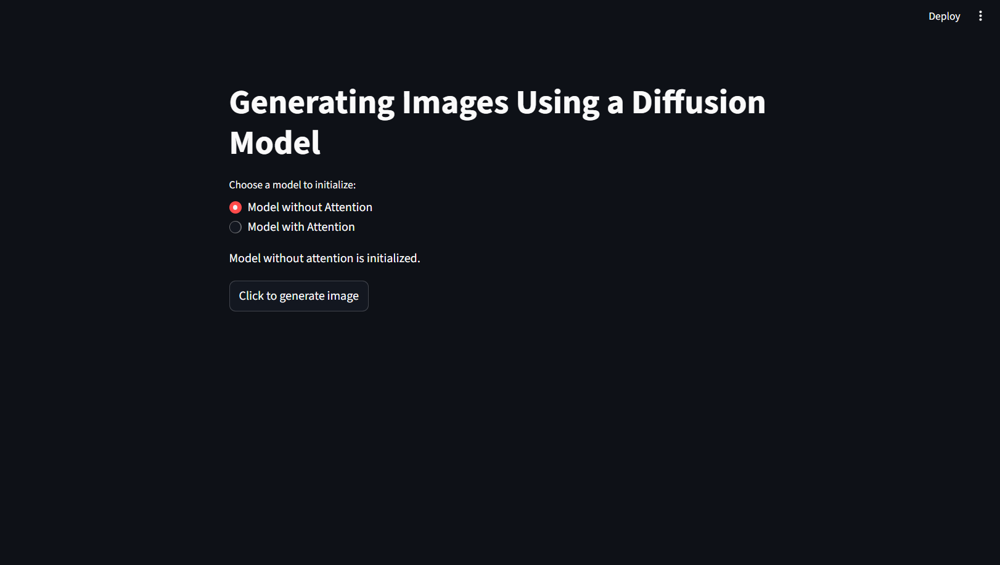

# Unconditional Image Generation with Diffusion Models

This project showcases the capabilities of a simple diffusion model, developed from scratch, which is trained on a dataset of flowers to generate new and unique images. Follow the instructions below to start exploring the application's functionalities.

### Installation and Setup

1. **Install Dependencies:**
   To ensure a smooth experience, install the required libraries by executing:
    ```python
    pip install -r requirements.txt
    ```

2. **Launch the Application:**
   Initiate the application by running:
    ```python
    streamlit run app.py
    ```

### Navigating the Application

**Starting the Application:**
When you launch the application, you'll be greeted with an intuitive interface. You'll have the option to select between "Model without Attention" and "Model with Attention". Choose one to generate images from the corresponding model. This feature is designed to demonstrate the impact of incorporating attention mechanisms on the quality of generated images. To begin generating images, simply click the "Generate New Images" button, and the model will start producing around 60 new images.

## Diffusion Model Interface



**Inference Time:**
Be aware that generating images on a CPU may take between 3 to 5 minutes. Your patience is appreciated during this time. However, if you're using a GPU, the process will be significantly quicker, typically taking less than 1 minute.
